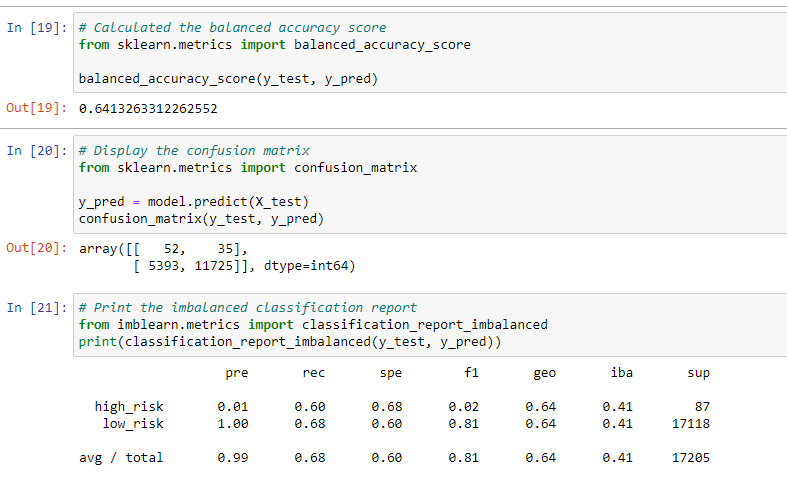

# Credit_Risk_Analysis

## Purpose
The purpose of this project is to predict credit risk using maching learning. The credit card dataset obtained was from a lending services company called LendingClub. The data will be over and undersampled using RandomOverSampler, SMOTE and ClusterCentroids algorithm. From there, machine learning models, BalancedRandomForestClassifier and EasyEnsembleClassifier will be used to further predict credit risk. The findings should then allow me to evaluate which unbiased model performed the best.

## Results

In total, 6 machcine learning models were used. 

### Naive Random Oversampling
* The balanced accuracy score was 64%
* The precision score had a high risk of 0.01 and the low risk of 1.00
* The recall score had a high risk of 0.60 and a low risk of 0.68

 

