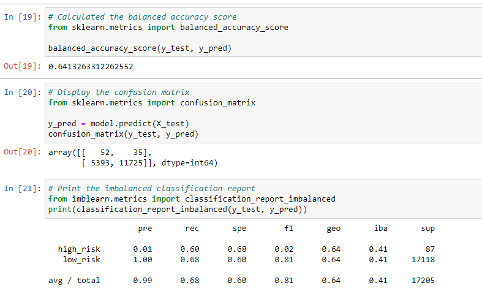
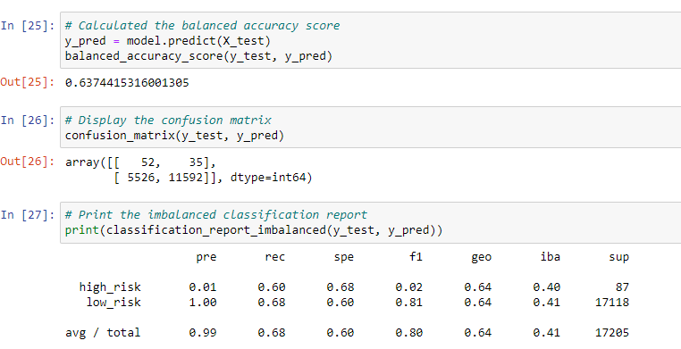
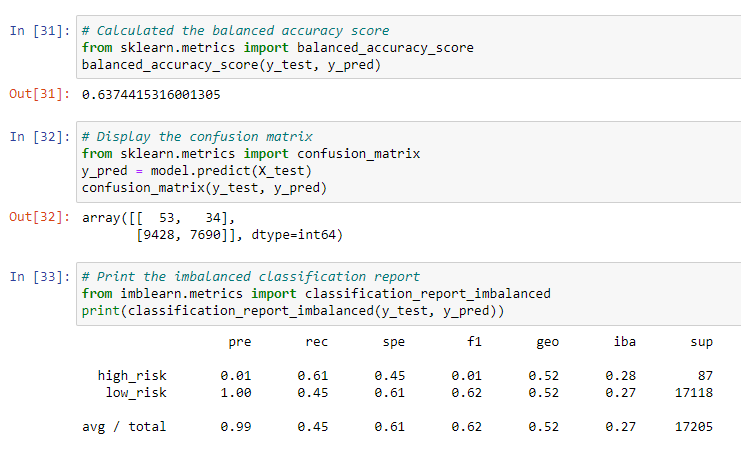
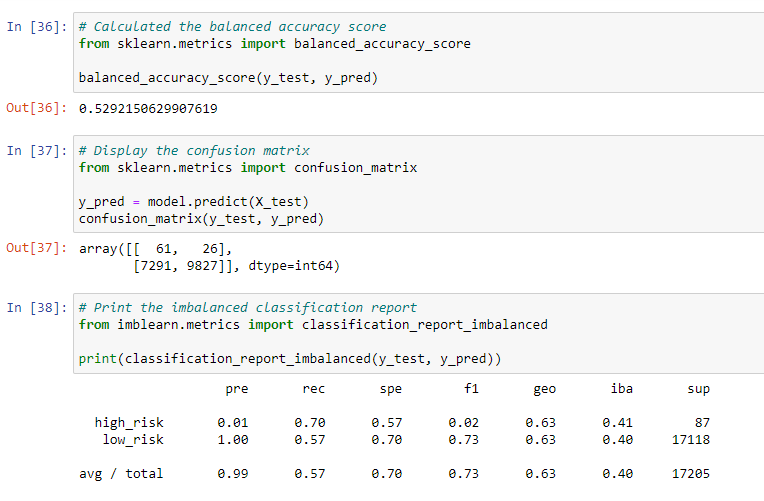
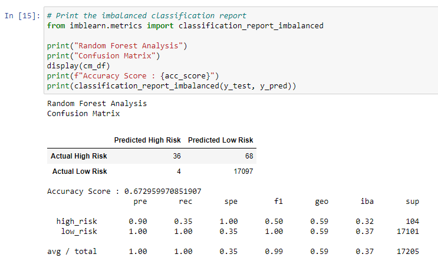
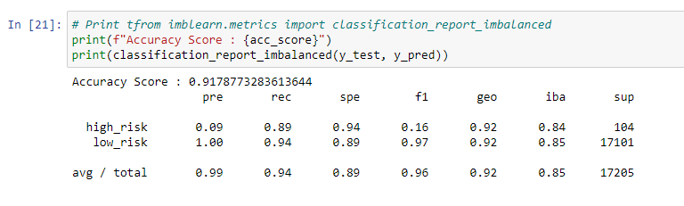

# Credit_Risk_Analysis

## Overview
In recent years, the FinTech industry has utilized Machine Learning for analyzing and predicting credit risk for their potential users. Machine Learning involves using statistical algorithms to learn patterns from data and make predictions, which is why it is a powerful tool for this purpose. It provides a faster and more reliable loan experience, and can accurately choose candidates for credit loans. However, selecting the appropriate model requires multiple evaluations to determine the one that best fits the specific data.

For this project, we tackled a real-world challenge involving credit card risk, using a dataset from LendingClub, a peer-to-peer lending services company. This type of risk presents an inherent unbalanced classification problem, since good loans far outnumber risky ones.

## Results

In total, 6 machine learning models were used 

### 1. Naive Random Oversampling
* The balanced accuracy score was 64%
* The precision score had a high risk of 0.01 and a low risk of 1.00
* The recall score had a high risk of 0.60 and a low risk of 0.68

 

### 2. SMOTE Oversampling
* The balanced accuracy score was 63%
* The precision score also had a high risk of 0.01 and a low risk of 1.00
* The recall score also had a high risk of 0.60 and a low risk of 0.68

 

### 3. Cluster Centroids Undersampling
* The balanced accuracy score of 64%
* The precision score with a high risk of 0.01 and a low risk of 1.00
* The recall score with a high risk of 0.60 and a low risk of 0.68

 

### 4. Combination (Over and Under) Sampling
* The balanced accuracy score was 63%
* The precision score also had a high risk of 0.01 and a low risk of 1.00
* The recall score also had a high risk of 0.70 and a low risk of 0.57

 

### 5. Balanced Random Forest Classifier
* The balanced accuracy score was 67%
* The precision score also had a high risk of 0.90 and a low risk of 1.00
* The recall score also had a high risk of 0.35 and a low risk of 1.00

 

### 6. Easy Ensemble AdaBoost Classifier
* The balanced accuracy score was 92%
* The precision score also had a high risk of 0.90 and a low risk of 1.00
* The recall score also had a high risk of 0.89 and a low risk of 0.94

 

## Summary
After conducting the analysis, the model that performed the best was the Easy Ensemble AdaBoost Classifier. This model had an accuracy score of 92% which beats out all other models(accuracy score of < 70%) conducted in this analysis.
